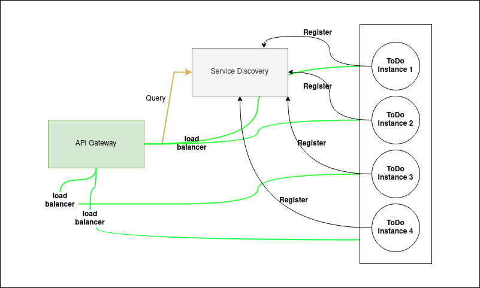
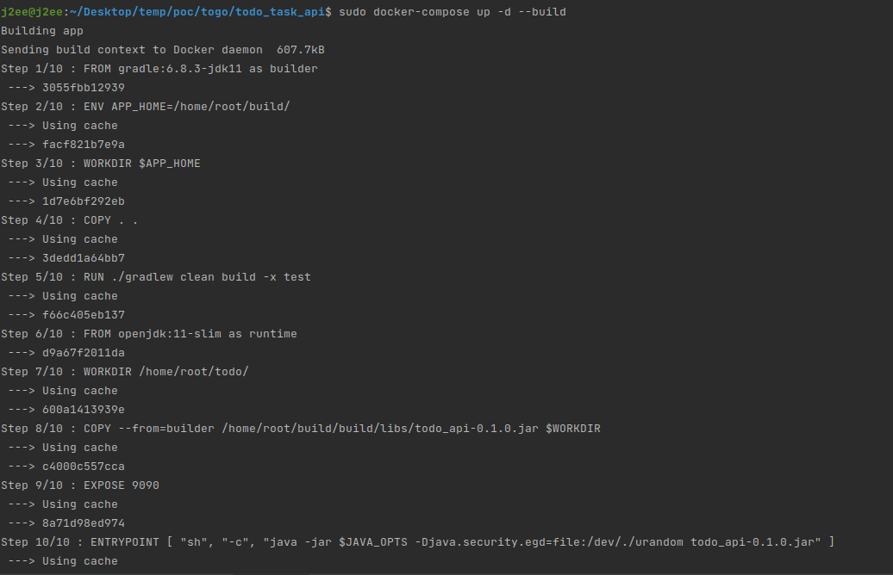
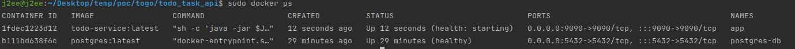

# Todo-Service
# System Infrastructure and Integration

#For deployment to production API
1. API Gateway :  http://localhost:7070
2. Service Discovery :  http://localhost:8080
3. Todo API :  http://localhost:9090/swagger-ui.html

#For run test on locally:
1. sudo docker-compose up -d --build / docker-compose up -d --build
   
   
2. Todo API :  http://localhost:9090/swagger-ui.html

#Spring Boot Profiles for DEV and PROD Environments
-Dspring.profiles.active=dev

#How to run your code locally?
- Change the config path to database in the resources/application.properties
- ./gradlew clean build -x test
- cd build/libs -> java -jar todo_api-0.1.0.jar
#A sample “curl” command to call your API
- We are use swagger as the API document, you can find curl on swagger : http://localhost:9090/swagger-ui.html
#How to run your unit tests locally?
- /gradlew clean build
#What do you love about your solution?
- I designed a service-oriented structure and the system can auto-scaling when overloaded, this solution to solve the problem with a large number of users accessing the system.
#What else do you want us to know about however you do not have enough time to complete?
- The system still has many functions to complete such as:
    - Event-driven architecture
    - Monitoring Prometheus + Grafana
    - SSO
#Swagger UI

