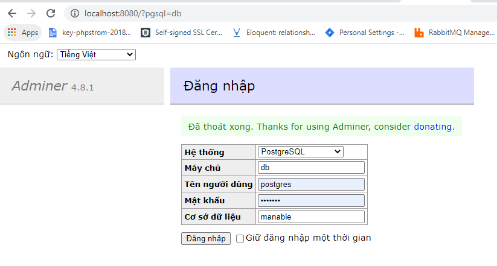
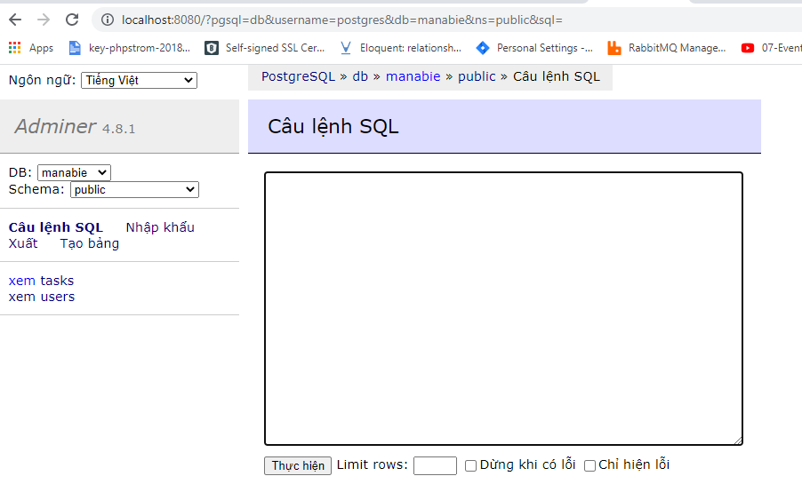

# Mini API
This is a nodejs API (MVC)

## Installation
Run Docker compose (install Postgres && Adminer)

    cd docker && docker-compose up
Import Postgres database 
    
    import database from file "database/manabie_postgres.sql" into PostgresSql by adminer
Run Adminer http://localhost:8080 (password: **example**)



Install the packages for nodejs (open terminal)

```bash
npm install
```

Run the program (open terminal)

```bash
npm run local
```

## Use

Open Postman and run test with host (http://localhost:4000/api/v1/) 
Or you can import file "**test/postman_testing.json**" into Postman
* Login API http://localhost:4000/api/v1/login
    * Method: POST
    * Header: 
        ```json
        {
          "Content-Type": "application/json"
        }
        ```
    * Body content
        ```json
        {
          "username": "test",
          "password": "123456"
        }
        ```
* Tasks API http://localhost:4000/api/v1/tasks
  * Method: POST
  * Header: 
    ```json
    {
      "Content-Type": "application/json",
      "authorization": "Bearer {TOKEN}"
    }
    ```
  * Body content
      ```json
      {
        "content": "..."
      }
      ```
## Unit Test
Run the program (open terminal)

```bash
npm run test
```