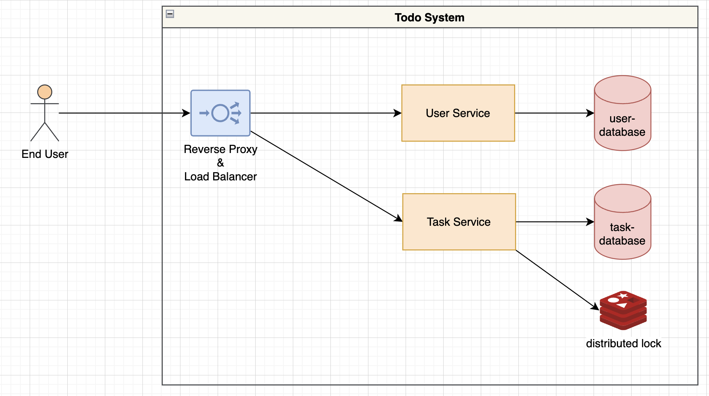

# Architecture

The project's design is based on microservice architecture and communicate via Restful

The system have 6 component:
- Reverse proxy & Load balancer (`Nginx`)
- User Service: manage user account and all setting
- Task Service:
  + task counter: `rate limiter` is based on `leaky bucket algorithm` with no `weight`
  + manage task by  user
- User Database: is a `Postgres` instance for User Service
- Task Database: is a `Postgres` instance for Task Service
- Distributed Lock: is a `Redis` instance for caching & concurrent lock in distributed system

# Source structures
```sh
└── com
    └── manabie
              └──todo
                    ├── config : infrastructure config
                    ├── constant : All constants values that can be used in the services
                    ├── controller : It is the public face of the application layer. It routes incoming requests and returns responses.
                    ├── entity : Object was mapped with database
                    ├── exception: Common exception
                    ├── model: Object was mapped with request/response and business model
                    ├── repository: interact with infrastructure to get resources for service layer
                    ├── service: The domain layer is responsible for encapsulating complex business logic, or simple business logic that is reused by multiple Controller
```
# Software usage
- Spring Boot
- Spring Reactive Webflux
>Spring Framework uses Project Reactor as the base implementation of its reactive support, and also comes with a new web framework, Spring WebFlux, which supports the development of reactive, that is, non-blocking, HTTP clients and services.
- Docker
>Deploying Our Microservices Using Docker

# Running the microservices
1. Run `mvn clean package -Dmaven.test.skip` to build the applications.
2. Run `docker-compose up -d` to create the docker image locally and start the applications.
# How to use

1. First create new user to test
- Sample curl
```bash
curl --location 'localhost:8080/api/user' --header 'Content-Type: application/json' --data '{"username":"trungnguyen.tech","maxTaskPerDay":3}'
```

Which will respond with something like:

```json
{
  "status": {
    "message": null,
    "code": 200,
    "success": false
  },
  "data": {
    "id": 7,
    "username": "trungnguyen.tech1",
    "maxTaskPerDay": 3,
    "createdAt": "2023-04-22T16:05:55.162259378",
    "createdBy": null,
    "updatedAt": null,
    "updatedBy": null
  }
}
```
2. Call the create task with owner id (user was created in step 1)
> The endpoint http://localhost:8080/api/user used as gateway to `hide` the services behind the outside.

- Sample curl
```bash
curl --location 'http://localhost:8080/api/task' --header 'Content-Type: application/json' --data '{"title":"join daily meeting","description":"join daily meeting","owner":3}'                                
```

- Sample Response
```json
{
  "status": {
    "message": null,
    "code": 200,
    "success": false
  },
  "data": {
    "id": 1,
    "title": "join daily meeting",
    "description": "join daily meeting",
    "owner": 7,
    "status": "NEW",
    "createdAt": "2023-04-22T16:01:59.052947339",
    "createdBy": null,
    "updatedAt": null,
    "updatedBy": null
  }
}
```

## TODO
- Apply Authentication & Authorization service to protect system
- Apply *Kubernetes & Istio* as alternative deployment
- Apply Grafana, Prometheus and Kiali ... for tracing and monitoring to easilier debug and scale.
- Apply Kafka for internal call to get highly performant and scalable.
- Convert from Spring boot to Quarkus to enhance the performace
  (CPU & Memory usage).
- Do more testing & integration test on user-service ,task-service.
- Store user info in Redis cached for better perfomance and reduce cost.