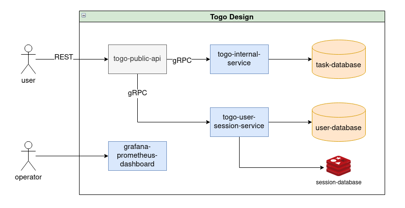
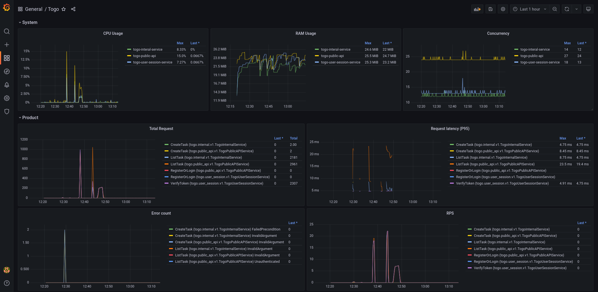

# Togo
Manabie's Technical Assignment

### Design architecture
The project's design is based on microservices architecture and heavily depend on google gRPC ecosystem


There are 3 main services:
- **togo-public-api**: public api to communicate with users
- **togo-internal-service**: service that interact with task database to handle biz logic
- **togo-user-session-service**: service that handle user's relatived operation create user, session

### Sequence diagram

 | 
|-|-|

### Project structure

```
├── api             # define service api
│   └── ...
├── buf.*           # buf config to generate proto
├── cmd             # entry point to run service
│   ├── migrate.go
│   └── serve.go
├── config          # config for different env
│   └── ...
├── internal
│   ├── handler     # bussiness handler
│   ├── model       # define model for internal usage
│   ├── storage     # storage interface
│   │   └── ...     # storage implementation
│   └── service     # external service
├── Makefile
├── mock            # mock/stub for testing
├── pkg             # export package
├── test            # integration tests
```
### Installation
Clone the repo:

``` bash
git clone https://github.com/giahuyng98/togo
cd togo
```

Make sure you have `golang` installed and using [go modules](https://github.com/golang/go/wiki/Modules) for dependency management.
And a running `redis` at default port 6379 (configurable)

### Running and Testing

There are 3 services so you have to run them in 3 different terminals
``` bash
# togo-internal-service
cd togo-internal-service
make build 
make test # unit test
make test-cover # unit test with coverage report
make run # run with default config
```

``` bash
# togo-user-session-service
cd togo-user-session-service
make build # build the service
docker run -p 6379:6379 -d redis # run redis
make run # run with default config

```

``` bash
# togo-public-api
cd togo-public-api
make build # build the service
make test-cover # unit test with coverage report
make run # run with default config
```

Test the API

``` bash
# login with default user
TOKEN=$(curl -X POST localhost:9090/v1/users -d '{"username":"admin","password":"admin@@"}' | jq -r '.token')

# list 10 tasks
curl localhost:9090/v1/tasks?pageSize=10 -H "Authorization: Bearer $TOKEN"

# create task (default limit daily = 5 tasks per user)
curl -X POST localhost:9090/v1/tasks -H "Authorization: Bearer $TOKEN" -d '{"title":"finish togo","content":"1. write docs 2. integration tests"}'
```

### Monitoring
These services have exported prometheus metrics. To view these metrics you need to have a running [prometheus](https://prometheus.io/docs/prometheus/latest/installation/) and [grafana](https://grafana.com/docs/grafana/latest/installation/docker/). Please have a look at `scripts/prometheus*` if you want to config/run prometheus



### Thing to be done
- [opentracing](https://opentracing.io/) with trace_id for each request across services
- consider using jwt token
- use protobuf for session storage
- switch to postgresql instead of sqlite
- customize error response
- setup pipeline github
- have a swagger-ui for easy testing
- more unit tests, integration test