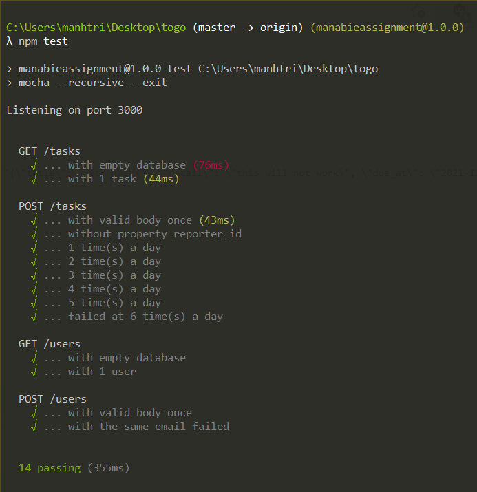

# Manabie Application Assignment: A simple API for creating daily tasks
## Requirements
- [x] Implement one single API which accepts a todo task and records it.
- [x] [There is a **maximum limit of 5 tasks per user** that can be added per day](#validateTaskCount).
- [ ] Write integration (functional) tests.
- [x] Write unit tests.
- [x] Choose a suitable architecture to make your code simple, organizable, and maintainable
- [x] Write a concise README
  - [x] [How to run your code locally?](#runAppLocally)
  - [x] [A sample “curl” command to call your API](#curlApi)
  - [x] How to run your unit tests locally?
  - [x] What do you love about your solution?
  - [x] What else do you want us to know about however you do not have enough time to complete?

_The detailed description of the assignment can be found [here](https://github.com/manabie-com/togo)_
# Table of contents
- [How to run the app locally](#runAppLocally)
  - [Prerequisites](#preReq)
  - [Start the server](#startServer)
  - [Create a user](#createUser)
  - [Add a new task](#curlApi)
  - [View task count](#viewTaskCount)
  - [Maximum number of tasks submitted per day by a user: 5](#validateTaskCount)
- [Unit test](#unitTest)

# <a name="runAppLocally">How to run the app locally</a>
## <a name="preReq">Prerequisites:</a>
- NodeJS ^14.17. You can download NodeJS runtime [here](https://nodejs.org/en/).

`npm install` to install all the dependencies.
## <a name="startServer">Start the server</a>
In your terminal, run:
```
npm start
```
Your server is ready at: http://localhost:3000.
```bash
> curl http://localhost:3000 | json
{
  "message": "API ready"
}
```
The `| json` tag is there to make the output more readable.
## <a name="createUser">Create a user</a>
On Windows:
```bash
curl --header "content-type: application/json" --request POST --data "{\"name\": \"frank\", \"email\": \"frank@mail.com\"}" http://localhost:3000/users | json
```
On MacOS:
```bash
curl --header "content-type: application/json" --request POST --data '{"name": "frank", "email": "frank@mail.com"}' http://localhost:3000/users | json
```
Expected output:
```json
{
    "id": 1,
    "name": "frank",
    "email": "frank@mail.com",
    "created_at": "2021-12-17 07:21:09"
}
```
You have successfully created a user with `id` (auto generated), `name` and `email`.
## <a name="curlApi">Add a new task</a>
On Windows:
```console
curl --header "content-type: application/json" --request POST --data "{\"title\": \"get grocery\", \"detail\": \"buy eggs and ham\", \"due_at\": \"2021-12-31 23:59:59\", \"reporter_id\": 1}" http://localhost:3000/tasks | json
```
On MacOS:
```console
curl --header "content-type: application/json" --request POST --data '{"title": "get grocery", "detail": "buy eggs and ham", "due_at": "2021-12-31 23:59:59", "reporter_id": 1}' http://localhost:3000/tasks | json
```
Expected output:
```json
{
    "id": 1,
    "title": "get grocery",
    "detail": "buy eggs and ham",
    "due_at": "2021-12-31 23:59:59",
    "created_at": "2021-12-17 07:24:21",
    "reporter_id": 1,
    "assignee_id": null
}
```
## <a name="viewTaskCount">View task count</a>
```console
> curl http://localhost:3000/tasks/count | json
{
  "results": [
    {
      "created_date": "2021-12-17",
      "reporter_id": 1,
      "task_count": 1
    }
  ]
}
```
**<a name="validateTaskCount">Maximum number of tasks submitted per day by a user: 5</a>**

When you have already created 5 tasks a day, the API responded with:
```bash
> curl --header "content-type: application/json" --request POST --data "{\"title\": \"6th task\", \"detail\": \"this will not work\", \"due_at\": \"2021-12-31 23:59:59\", \"reporter_id\": 1}" http://localhost:3000/tasks | json
{
    "success": false,
    "message": "Reached task count limit of 5"
}
```
# <a name="unitTest">Unit test</a>
Technologies involved:
- `mocha` to create test framework
- `chai` assertion library
- `supertest` to create a mock HTTP request

## Test cases
- GET /tasks
  - View all tasks when there are no data.
  - View all tasks when there is 1 data row.
- POST /tasks
  - Send POST request with valid body.
  - Send POST request with body missing property.
  - Try to create 6 tasks a day.
- GET /users
  - View all users when there are no data.
  - View all users when there is 1 data row.
- POST /users
  - Send POST request with valid body.
  - Create a user with duplicated email, responded with `{ "message": "email duplicated" }`
