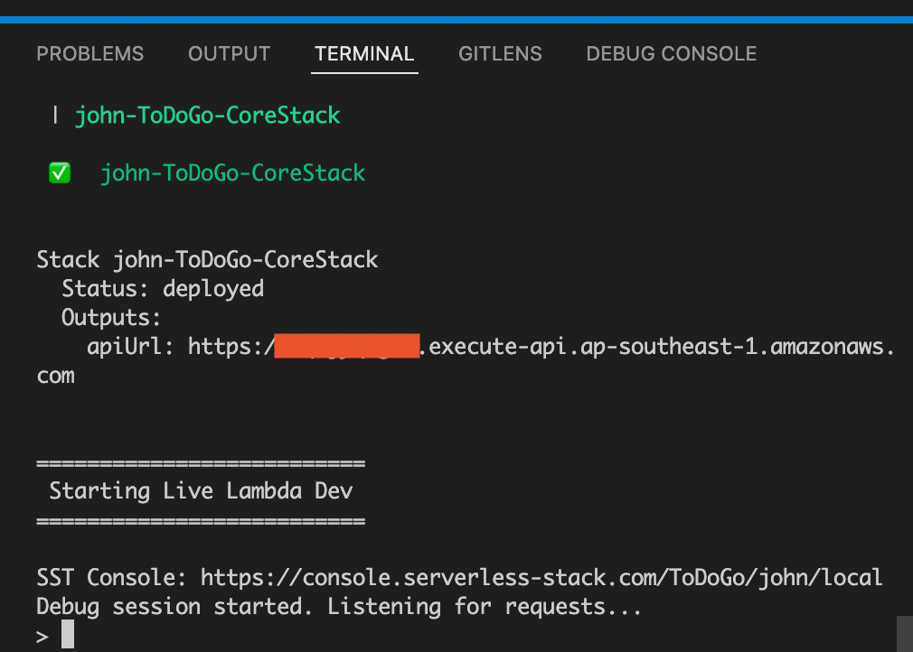

# TODO Go

## Pre-requisites

- [NodeJS](https://nodejs.org/en/download/)
- [Golang](https://go.dev/dl/)
- [AWS CLI v2](https://docs.aws.amazon.com/cli/latest/userguide/install-cliv2.html)
- Configured AWS Credentials
  - AWS IAM User with required permissions on resources needed to run the api. You should have an `AWS_ACCESS_KEY_ID` and `AWS_SECRET_ACCESS_KEY` to configure locally with aws cli.
  - Configuration Guide: https://docs.aws.amazon.com/cli/latest/userguide/cli-configure-quickstart.html#cli-configure-quickstart-config

## Local Development

This application uses the [serverless-stack](https://serverless-stack.com) platform for local development.

From the serverless-stack docs

> [Serverless-Stack Guide](./docs/sst.md) SST provides a cloud native local development environment that gives you instantaneous feedback on edits made in your Lambda function code. Changes are automatically detected, built, and live reloaded in under 10 milliseconds. And you can use breakpoints to debug your functions in your favorite IDE.

This means that we need an AWS account and network connection to it to be able to do local development.
Once the AWS credentials are configured, you can now install the dependencies and start the live lambda environment.

### Install npm dependencies

    $ npm install

### Install go dependencies

    $ cd backend
    $ go mod download

### Start the environment.

The default AWS region used for this API is `ap-southeast-1 (Singapore)`. To change this, you can edit the file `sst.json` and use your preferred AWS region.

    $ cd ../ # Go back to the project root
    $ npx sst start --stage <yourName>

This will build and deploy 2 cloudformation stacks to your AWS account (`<yourName>-ToDoGo-DebugStack` and `<yourName>-ToDoGo-CoreStack`).

Once the build and deployment finish, you will find the `apiUrl` in the command line/terminal.

### Call the Endpoints

To be able to create a Task in this API, a User is required to be created first.

Create a User

    $ curl -d '{"daily_limit": 2}' -H 'Content-Type: application/json' <apiUrl>/users

Take note of the returned autogenerated user id (`userId`) as this will be used in the Create Task request.

Create a Task

    $ curl -d '{"title":"taskTitle","due_date":"2022-06-02T19:00:00+08:00"}' -H 'Content-Type: application/json' <apiUrl>/users/<userId>/tasks

## Unit Tests

To run the unit tests locally (from the project root)

    $ npm run gotest

## What do you love about your solution?

The solution I created is using the serverless model thus making it easier and faster for me to develop and make the application ready for production.

However, I was still able to use a structure where most of my core code can be used if ever I want to deploy my application without using serverless. For example, for the storage, I am using dynamodb at the moment. But it will be easy for me to add a Postgres implementation which will satisfy the Storage interface. This won't break my services.

The services folder also contains reusable code. If I decide to use a golang library/framework like gin, gorilla mux or the standard go http library, I can create handlers on top of my services and I don't need to worry much about my services code breaking.

## What else do you want us to know about however you do not have enough time to complete?

I wasn't able to add input validation in the lambda handlers nor as middlewares but this is a priority addition.

The logging is also lacking. Monitoring is a very important part of applications so it would be great if there is tracing, correlation ids, and metrics added in this application.

Another thing missing is the authorization, although this is not part of the requirements.

There are other things I would have liked to handle more properly like maybe storing the timezones of the dueDate for the task but these are no longer part of the scope of this.
