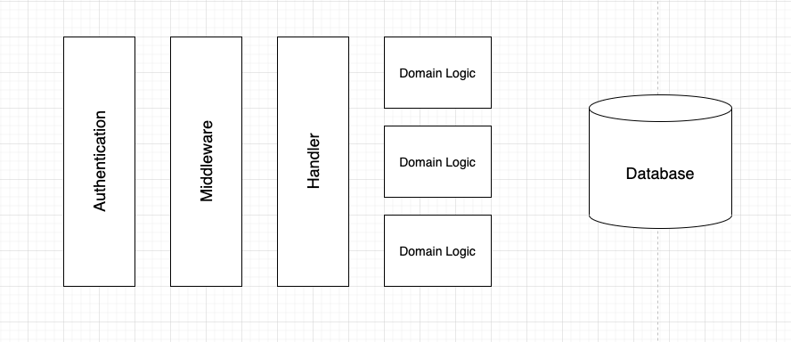

## What have done
 - Apply rate limit on add task endpoint by getting `max_todo` config for specific user


## What can be improved
 - Current structure is hard to do unitest or api test because it's tightly coupling to each other
 - There are several changes need to do first before apply test, the main goal is separate domain logic(`task`) from other concerns(`rate limit`, `auth`):
   * Separate `auth` from `task` domain, by create a middleware for the server. The middleware can validate user info from request token before reach to task apis. Some lib suggest : echo, chi, gin-tonic
   * Separate `ratelimit` from `addTask` api. rate limiting should not be add task logic. Should create a custom middleware to filter request before it reach to `addTask` api. By doing this we can easy to test ratelimit
   * Apply in-mem db eg sqlite to support api test
   * Error handling and logging
   * Migration 
 * When those concerns are seperated, we can do api test and unit test easier

##My recommended structure 
Inspired by go-clean-arch
```
- cmd #where all cmd file contain
    - main # entry point for the app
    - migration # contain migration script as well as seed data
- domain # Contain all domain model and domain interface
    - auth # model and interface(usecase, repository,handler for auth)
    - task  # model and interface(usecase, repository,handler for task)
- auth #Auth domain
    - handler # router for auth, api test will be test here
    - usecase # contain all domain service, unitest can be test here
    - repository # data access layer
- task #Task domain
    - handler
    - usecase
    - repository
- pkg #util class that consume from all above package
```
##Idealy structure flow

