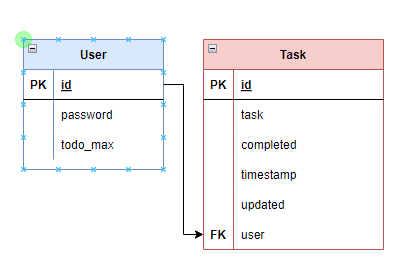

### Desctiption
- This project provide some API which allow to:
  - Create user with infomation about maximum limit of tasks which user can added per day
  - Update user to change maximum limit of tasks when have demand
  - Create tasks with maximum limit per day per user (different user have different maximum daily limit)
  - Update/ Delete tasks owner
- Technology used:
  - Django REST Framework
  - Authentication method: Basic Authentication
### Usage
- Require: Python 3.9.x
- Install requirements modules: `pip install -r requirements.txt`
- Change directory to project folder: `cd todo` 
- Run migrate: `python manage.py migrate`
- Start server: `python manage.py runserver` this command will start server at: `http://127.0.0.1:8000/`
- List API:
  - User:
    - Create User: `curl -d "username=username&password=password&todo_max=todo_max" -X POST http://127.0.0.1:8000/todo/user/register/`
    - Retrieve User info: `curl -u username:password http://127.0.0.1:8000/todo/user/`    
    - Update User: `curl -u username:password -d "todo_max=todo_max" -X PUT http://127.0.0.1:8000/todo/user/`
  - Task:
    - Create Task: `curl -u username:password -d "task=task&completed=completed" -X POST http://127.0.0.1:8000/todo/task/`
    - Retrieve User Tasks: `curl -u username:password http://127.0.0.1:8000/todo/task/`    
    - Retrieve Task Detailed: `curl -u username:password http://127.0.0.1:8000/todo/task/<task_id>/`
    - Update Task: `curl -u username:password -d "task=task&completed=completed" -X PUT http://127.0.0.1:8000/todo/task/<task_id>/`
    - Delete Task: `curl -u username:password -X DELETE http://127.0.0.1:8000/todo/task/<task_id>/`
- Simple UI:
  - You can perform list API via web browser using API links.
  - Example: Go `http://127.0.0.1:8000/todo/user/register/`
  - List link:
    - Login: `http://127.0.0.1:8000/api-auth/login/?next=/todo/user/`
    - Create User: `http://127.0.0.1:8000/todo/user/register/`
    - Retrieve/ Update User: `http://127.0.0.1:8000/todo/user/`
    - Create Task/ Retrieve User Tasks: `http://127.0.0.1:8000/todo/task/`
    - Retrieve Task Detailed/ Update/ Delete: `http://127.0.0.1:8000/todo/task/<task_id>/`
### Test
- Test case location:`togo/todo/todo_api/test.py`
- Run Test: `python manage.py test`
- List TestCase:
  - UserTestCases:
    - create user success
    - create user without username
    - create user with username is exist
    - create user with username exceed 150
    - create user with short password
    - create user with todo_max is less than 0
    - create user with todo_max is not integer
    - create user with todo_max is none
    
    - retrieve user success
    - retrieve user id not exist
    
    - update user success
    - update user with todo_max is less than 0
    - update user with todo_max is not integer
    - update user with todo_max is none
  
  - TaskTestCases:
    - create task success
    - create task without task name
    - create task with completed is not boolean
    - create task exceed daily limit (todo_max)
    
    - retrieve list task by user id
    - retrieve task by task id
    
    - update task success
    - update task with empty task name
    - update task with completed is not boolean

### Entity Relation

