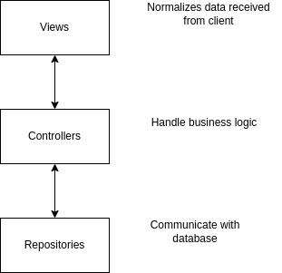

### Requirements

- Implement one single API which accepts a todo task and records it
  - There is a maximum **limit of N tasks per user** that can be added **per day**.
  - Different users can have **different** maximum daily limit.
- Write integration (functional) tests
- Write unit tests
- Choose a suitable architecture to make your code simple, organizable, and maintainable
- Write a concise README
  - How to run your code locally?
  - A sample “curl” command to call your API
  - How to run your unit tests locally?
  - What do you love about your solution?
  - What else do you want us to know about however you do not have enough time to complete?

### Notes

- We're using Golang at Manabie. **However**, we encourage you to use the programming language that you are most comfortable with because we want you to **shine** with all your skills and knowledge.

### How to submit your solution?

- Fork this repo and show us your development progress via a PR

### Interesting facts about Manabie

- Monthly there are about 2 million lines of code changes (inserted/updated/deleted) committed into our GitHub repositories. To avoid **regression bugs**, we write different kinds of **automated tests** (unit/integration (functionality)/end2end) as parts of the definition of done of our assigned tasks.
- We nurture the cultural values: **knowledge sharing** and **good communication**, therefore good written documents and readable, organizable, and maintainable code are in our blood when we build any features to grow our products.
- We have **collaborative** culture at Manabie. Feel free to ask trieu@manabie.com any questions. We are very happy to answer all of them.

Thank you for spending time to read and attempt our take-home assessment. We are looking forward to your submission.

### Architecture

Overall architecture diagram

### Usage
#### Testing
Run `./launch_test.sh`. It will run a test database and the test suite inside the docker. Once the test is completed, you can exit by pressing Ctrl+C
#### Demo
Run `./launch.sh`. It will automatically migrate and create test users for the database. The http server will be served on port 8090. The api can be test by calling `./test_curl.sh [user_id] [task-title] [task-content]`. User with id i will have task limit of i + 1. You can also set the time offset to simulate a day in the future by setting SIM_OFFSET_DAY value in the docker-compose.yaml

### Note
Because performance is not a concern, I'm counting the number of tasks created on a particular day to enforce the task limit constraint. However, this requires that I have a serializable isolation level which will likely affect the performance. One way to solve this is to instead create a seperate table for counting the nubmer of tasks created. Hence, only repeateable read isolation will be needed. However, it is not as flexible in terms of time zone as the current solution.

(Update) So after doing some testing, apparently postgres is smart enough to not signal a serializable conflict when using unrelated rows on indexed columns. So if I issue `SET enable_seqscan = OFF;`, the index scan should be reliably used and performance should be optimal
