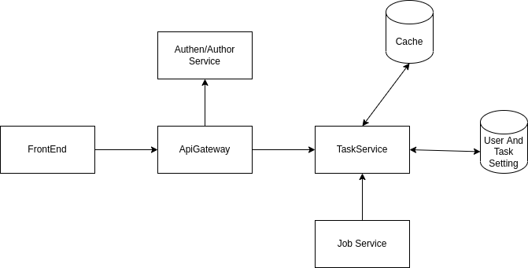

### High Level Design

- Our system should have authen/author service to check if user has the right to call api
- Assume that we have 10 million users.  each user has 10 tasks.  the size of row in manabie_task_limit_setting
  is 32 byte.
    => the total storage for setting will be 32 * 10M *10 ~= 3.2GB.
    => it is easy to load all the task setting to cache (no need to handle cache eviction)

### Detailed Component

- Due to lack of the time, authen service is involved in task service.
- I use redis for the cache and mysql for the permanent storage.
- Script to **initialize db schema** is inside function Initialize() (./store/persist/mysql.go)

### Api Design
- **To test if task limiter work or not**, you must do the following step: Create task, Create User, Set Task Limit, Login then call Do Task

| Api               | Purpose                                                    | Curl                                                                                                                                                                                   |
|-------------------|------------------------------------------------------------|----------------------------------------------------------------------------------------------------------------------------------------------------------------------------------------|
| Create User       | User Sign Up                                               | curl --location --request POST 'http://localhost:9999/p/manabie/signup' --header 'Content-Type: application/json' --data-raw '{ "username": "linpn", "password": "abc123"}'            |
| User Login        | User login and get jwt token                               | curl --location --request POST 'http://localhost:9999/p/manabie/login' --header 'Content-Type: application/json' --data-raw '{ "username": "linpn", "password": "abc123"}'             |
| Create Task       | Administrator create task                                  | curl --location --request POST 'http://localhost:9999/b/manabie/create-task' --header 'Content-Type: application/json' --data-raw '{ "taskName": "manabie_task_1", "description": ""}' |
| Set Task Limit    | Administrator set task limit for user                      | curl --location --request POST 'http://localhost:9999/b/manabie/set-limit' --header 'Content-Type: application/json' --data-raw '{"userId": 1, "taskId": 1, "limit": 10}'              |
| Do Task           | User try to do a task                                      | curl --location --request POST 'http://localhost:9999/e/manabie/do-task/1' --header 'Authorization: jwt_from_login'                                                                    |
| Reset daily tasks | Job service will call api to reset cache at the end of day |curl --location --request POST 'http://localhost:9999/j/manabie/reset-daily-tasks'|

- Apis called by user start with '/e' (external) which need Authorization header
- Apis called by administrator start with '/b' (back) which also need Authorization header and priority but I have not done yet
- Apis called by job service with '/j'
- User Create And Login are 2 public apis, start with '/p' (public)

### Deployment
- **Install mysql:**
  - docker pull mysql
  - docker run --name mysql-instance -e MYSQL_ROOT_PASSWORD=thangna -d mysql
- **Install redis:**
  - docker pull redis
  - docker run --name redis-instance -d redis
- **Go required version:** 1.17.5 
- **Command to run service:**
  - First way: **go run main/main.go -c conf/config.yml**
  - Second way: **go build -o goapp -mod=vendor main/main.go** then ./goapp -c conf/config.yml

### Note
- Due to lack of the time, I'm still not write unit test and integration test for this project.
- Again, I really apologize for submit task since I have to do a heavy load of work in my company 