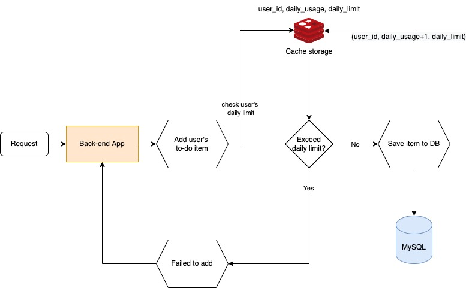

# To do API server

## Requirements

Implement one single API which accepts a todo task and records it

- There is a maximum limit of N tasks per user that can be added per day.
- Different users can have different maximum daily limit.

## Solution

Before inserting any user's to-do item to DB, check if their daily usage have exceeded limit or not. When an item is sucessfully added, their daily usage will increment by one (daily_usage++).
The user's daily usage is stored in a cache storage, specifically Redis, with TTL until the end of the current day, before resetting back to 0.

### System Design



### Backend structure


References:

- <https://github.com/bxcodec/go-clean-arch>
- <https://github.com/arielizuardi/golang-backend-blog>

## How to run

- `docker-compose up -d` to deploy local MySQL (port 3306) and Redis (port 6379).
- `export ENVIRONMENT=LOCAL`: make application read configs from .env file.
- `go run ./app/main.go` to start running back-end application (port 9090).
- Try sample request:

```bash
curl --location --request POST 'localhost:9090/user/todo' \
--header 'Content-Type: application/json' \
--data-raw '{
    "content": "Hello world",
    "user_id": 1
}'
```

## Unit test
Run `make app.unittest`

## Integration test
TBD

## [Database Schema](./scripts/database.sql)

## [External storages](./docker-compose.yaml)
