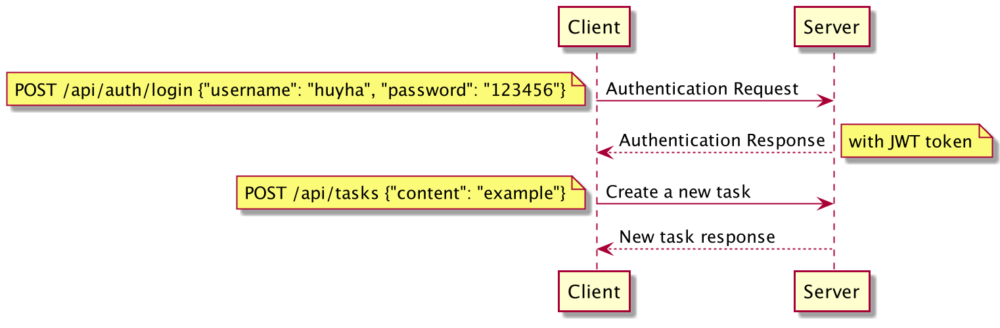

### My Manabie's Togo Solution
This is my solution for Manabie's Togo Challenge.
To make it run:
- Install docker & docker-compose
- Open terminal inside the folder containing `main.go`
- Run `docker-compose up --build`

### What I have done
#### Backend
- Dockerize app
- Decoupling DB access code and business logic
- Decoupling business logic from HTTP parsing and responding
- Change from `SQLite` to `Postgres`
- Hashing user password with `bcrypt`
- Limit N task per day
- Add features: `toggle task's status` and `delete task`
- Write integration tests
- Write unit tests for `service` package and `postgresql` package

#### Frontend
- Basic frontend with: `Login page`, `Signup page`, `Index page`
- Login interface
- List/Create/Delete/Toggle status interface
- State management using React hooks + Redux

### Postgres DB Schema
```sql
-- users definition

CREATE TABLE users (
	id varchar primary key,
	hash varchar,
	max_todo INTEGER,
);

-- tasks definition

CREATE TABLE tasks (
	id uuid primary key,
	content text,
	user_id varchar,
    created_date date,
);
```

### Sequence diagram

