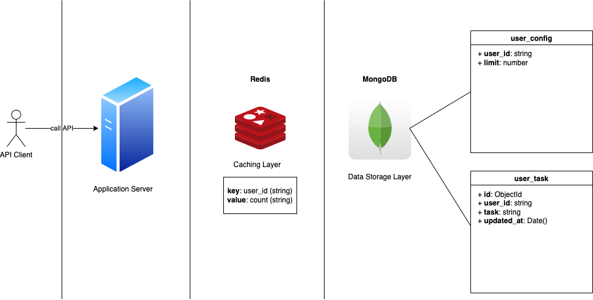

### Structure of the project


- `Application Server`: the API server that deals with user request.
- `Redis`: the caching layer, will help to control the limit count of user (followed by key, value definition in the image).
- `MongoDB`: the data storage layer, will help to store the user task log/record the task (followed by database schema in the image, `user_task` to record user task, `user_config` to store the user limit config).
### API contract
- Route: `/api/v1/task/record`
- Method: `POST`
- Request params: None
- Request body
```
user_id    string     the id of the record user
task       string     task name
```
- Sample request body
```json
{
  "user_id": "4",
  "task": "todo"
}
```
- Success response
```
Header: 200
Body:
{ 
    "message": "record success"
}
```
- Invalid quest body response
```
Header: 400
Body:
{ 
    "message":"invalid request body"
}
```
- Internal server error response
```
Header: 500
Body:
{
    "message": "record user's record error: user record record reached limit: 3"
}
```
### How to run your code locally?
  - Firstly, you must have `Redis`, `MongoDB` installed locally.
  - From the mongo shell, create the database `togo` with the command below
```azure
use togo
```
  - From the mongo shell, continue to create two collections `user_config` and `user_task` with commands
```azure
db.createCollection('user_config')
db.createCollection('user_task')
``` 
  - From the mongo shell, run this command to initialize user config data (you can add your own data if you want).
```azure
db.user_config.insertMany([{user_id:'1', limit: 3},{user_id:'2', limit: 4}, {user_id:'3', limit: 5}, {user_id:'4', limit: 6}])
```
  - Modify `RedisHost` and `RedisPort` in `cache/const.go` by your `Redis` host and port (local).
  - Modify `MongoURI` in `storage/const.go` by your `MongoDB` URI (local).
  - From the root directory, please run `make run` to start the project (it will call the command to run the `main.go` file).
  - The API server will listen on port `8083` followed by the `ServicePort` defined in the `main.go`, you can modify it if you want to run server on another port.
  - Note: when you reach any problems about the package, please run `make clean` to tidify the package dependency.
  - From now, you can call API with cURL below to record  task.
  
### A sample “curl” command to call your API

- When you start the project successfully, you can call the cURL below to add a task `todo` with user_id `4` (if the user doesn't reach his config limit)
```
curl --location --request POST 'localhost:8083/api/v1/task/record' \
--header 'Content-Type: application/json' \
--data-raw '{
    "user_id": "4",
    "task": "todo"
}'
```

### How to run your unit tests locally?

- To run all tests in the project, you can run the below command from the root directory:
```
make test
```
- To see the test coverage in the project, run the command below:
```
make test-coverage
```
- To run only the integration tests, run the command:
```
make test-integration
```

### What do you love about your solution?

- My project use `Go clean architect` (ref: https://github.com/bxcodec/go-clean-arch).
- The Go clean architect will divide the project structure into independent components with specific responsibilities (`repository` for contacting with data storage, `service` for business logic, `handler` for dealing with user request), so it will help the code cleaner with readability, maintainability, testability (because of independence) and easy to add new features (add layer per layer, from top to down or vice versa).
- This project uses `Redis` to control limit user instead of normal db storage (store in disk), it will speed up the process because of in memory save. Additionally, it helps me to know another use case of `Redis` beside caching large data.
- This project uses `MongoDB` to log user data, uses `NoSQL` instead of `SQL` so that it is faster in read/write data, it is suitable with this use case to log user task (can be a part of a log system). Also, the real log data is usually unstructured, so using `NoSQL` to store the log is also reasonable. 

### What else do you want us to know about however you do not have enough time to complete?

- Unfortunately, I got sick with a fever during the test time, but I still tried my best to complete as much as posible.
- This is the first time I write unit test with `Redis`, `MongoDB` and `gin` framework so it needs more researches, but I still tried the best to write.
- Integration test for the success case and unit tests for handler are missing, I think I will do refactoring the handler to write them if I have more time.
- Migration step is missing too, we have to database command manually to init the storage.
- However, I can say that the test coverage is still acceptable: `83.3%` but I agree that tests for handler and integration tests for success case are important.